## СТАТЫ 1

- epoch: 1500
- структтутутра:
    - self.fc1 = nn.Linear(42, 128)
    - self.fc2 = nn.Linear(128, 64)
    - self.fc3 = nn.Linear(64, 30)

### Итог
- Precision: 0.8493
- Recall: 0.8280
- F1 Score: 0.8340

## СТАТЫ 2

- epoch: 2100
- структтутутра:
    - self.fc1 = nn.Linear(42, 128)
    - self.fc2 = nn.Linear(128, 128)
    - self.fc3 = nn.Linear(128, 30)

### Итог
- Precision: 0.8493
- Recall: 0.8280
- F1 Score: 0.8340

## Статы 3

```python
    def __init__(self):
            super(SignLanguageNet, self).__init__()
            self.fc1 = nn.Linear(42, 128)
            self.fc2 = nn.Linear(128, 64)
            self.fc3 = nn.Linear(64, 30)

    def forward(self, x):
        x = F.relu(self.fc1(x))
        x = F.relu(self.fc2(x))
        x = self.fc3(x)
        return x

optimizer = torch.optim.Adam(params=model.parameters(), lr=0.005,  weight_decay=1e-4)
```

### Итог

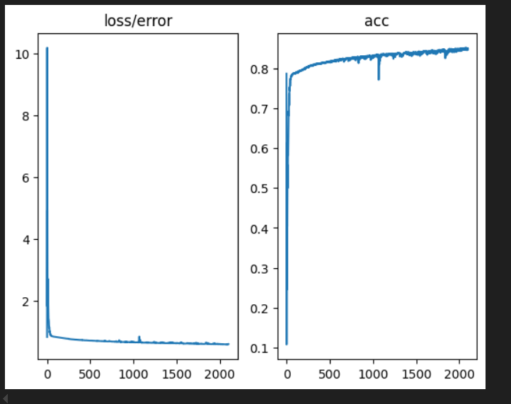

Acc: 0.8302024884118078


## Статы 4

```python
    def __init__(self):
        super(SignLanguageNet, self).__init__()
        self.fc1 = nn.Linear(42, 128)
        self.fc2 = nn.Linear(128, 64)
        self.fc3 = nn.Linear(64, 30)

    def forward(self, x):
        x = F.relu(self.fc1(x))
        x = F.relu(self.fc2(x))
        x = self.fc3(x)
        return x

criterion = nn.CrossEntropyLoss()
optimizer = torch.optim.Adam(params=model.parameters(), lr=0.001,  weight_decay=1e-4)
```

### Итог

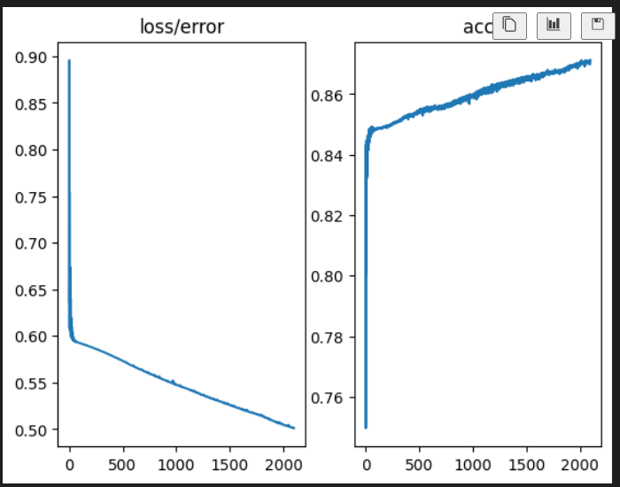

#### Acc: 0.8587460356184435

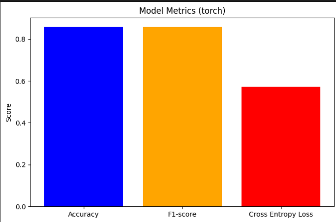

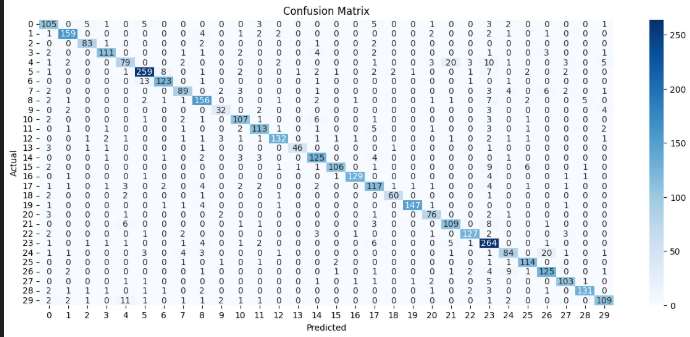

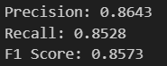


## Статы 5

**Добавляем dropout 0.2**

```python
    def __init__(self):
        super(SignLanguageNet, self).__init__()
        self.fc1 = nn.Linear(42, 128)
        self.fc2 = nn.Dropout(0.2)
        self.fc3 = nn.Linear(128, 64)
        self.fc4 = nn.Dropout(0.2)
        self.fc5 = nn.Linear(64, 30)

    def forward(self, x):
        x = F.relu(self.fc1(x))
        x = F.relu(self.fc3(x))
        x = self.fc5(x)
        return x

criterion = nn.CrossEntropyLoss()
optimizer = torch.optim.Adam(params=model.parameters(), lr=0.001,  weight_decay=1e-4)
```

### Итог

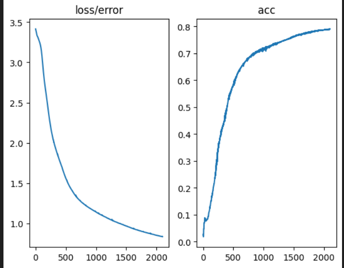

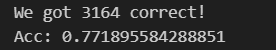

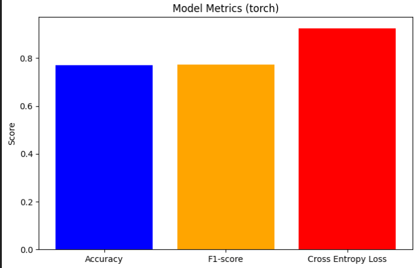

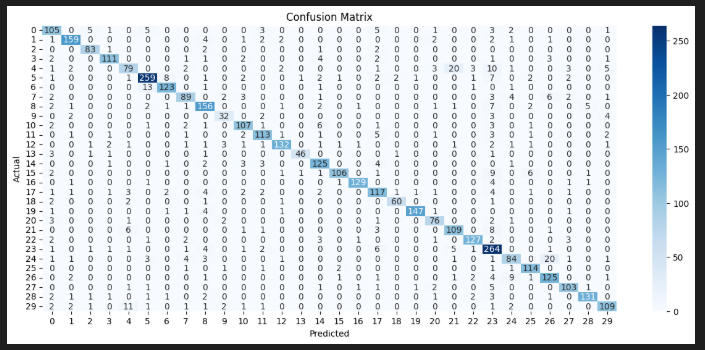

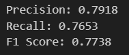


## Статы 6

**Удаляем dropout 0.2 на входном слое и убираем l2 регуляризацию**

```python
    def __init__(self):
        super(SignLanguageNet, self).__init__()
        self.fc1 = nn.Linear(42, 128)
        self.fc2 = nn.Dropout(0.2)
        self.fc3 = nn.Linear(128, 64)
        self.fc5 = nn.Linear(64, 30)

    def forward(self, x):
        x = F.relu(self.fc1(x))
        x = F.relu(self.fc3(x))
        x = self.fc5(x)
        return x

criterion = nn.CrossEntropyLoss()
optimizer = torch.optim.Adam(params=model.parameters(), lr=0.001)
```

### Итог

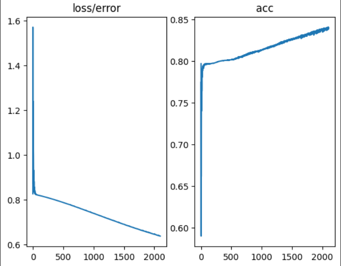

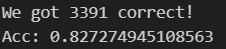

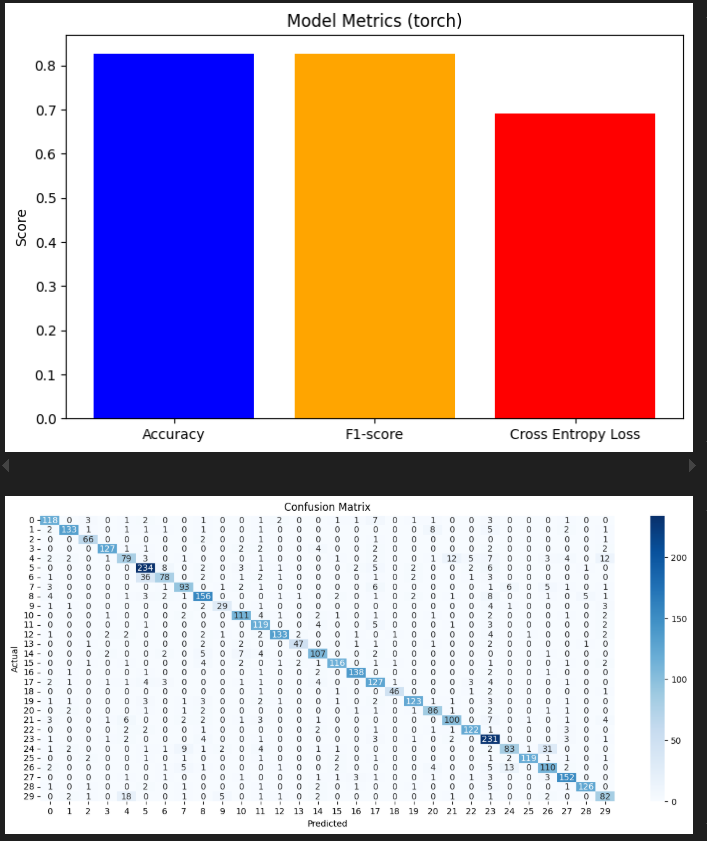

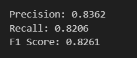


## Статы 7

**Удаляем dropout и добавляем l2 регуляризацию**

```python
    def __init__(self):
        super(SignLanguageNet, self).__init__()
        self.fc1 = nn.Linear(42, 128)
        self.fc3 = nn.Linear(128, 64)
        self.fc5 = nn.Linear(64, 30)

    def forward(self, x):
        x = F.relu(self.fc1(x))
        x = F.relu(self.fc3(x))
        x = self.fc5(x)
        return x

criterion = nn.CrossEntropyLoss()
optimizer = torch.optim.Adam(params=model.parameters(), lr=0.001, weight_decay=0.0001)
```

### Итог

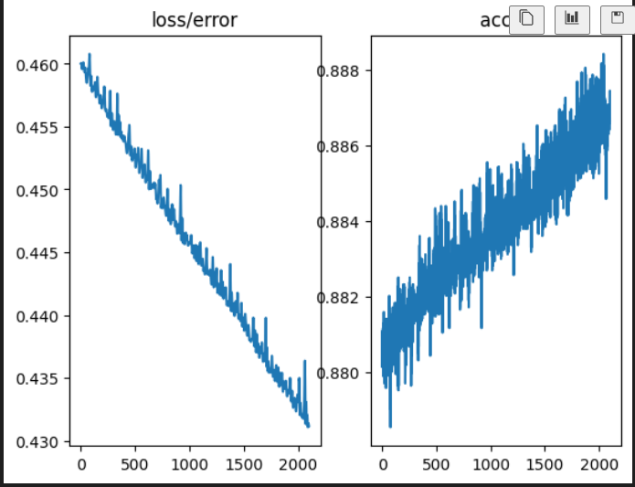

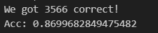

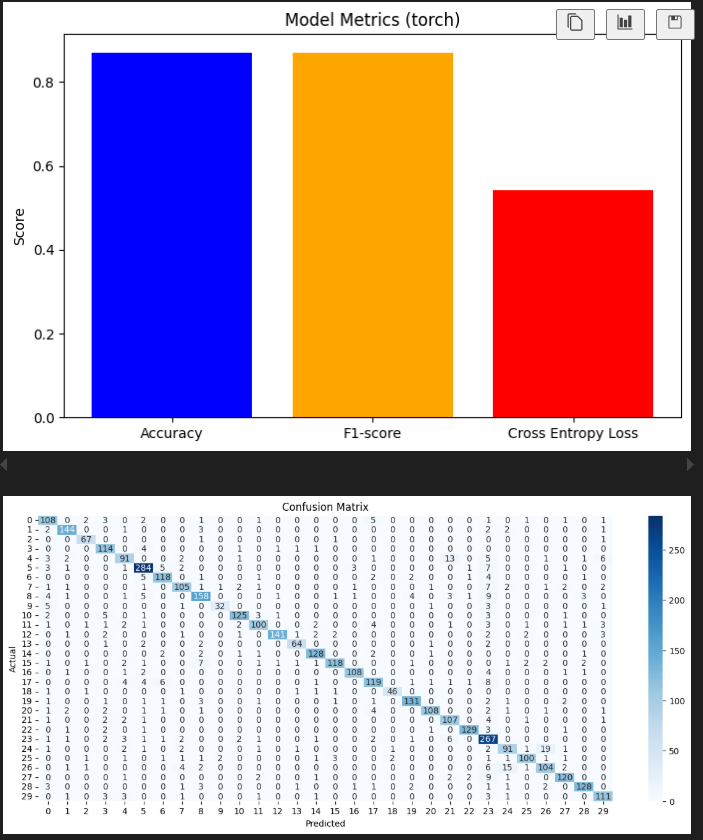

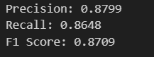